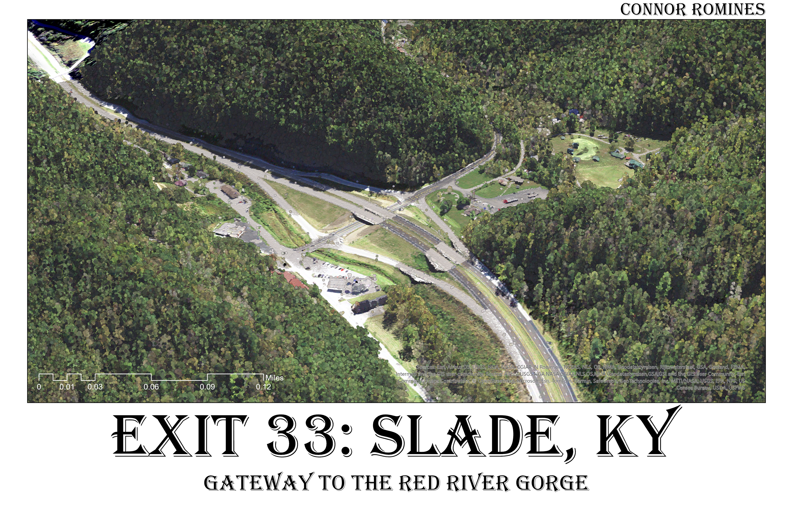
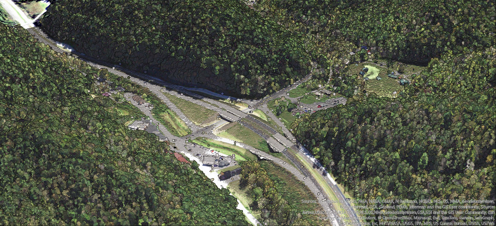

Exit 33: Slade, Kentucky
The Gateway to the Red River Gorge: Slade's Shell, Little Caesar's, and the Kentucky Reptile Zoo

     
*A point cloud showing Mountain Parkway exit 33. From this exit, thousands of hiking trails, climbing routes, and gorgeous vistas can be found. Click the link below to see an animated flyover.*

     
*[Link to flyover animation](https://youtu.be/yz9KNZm3k54M)*